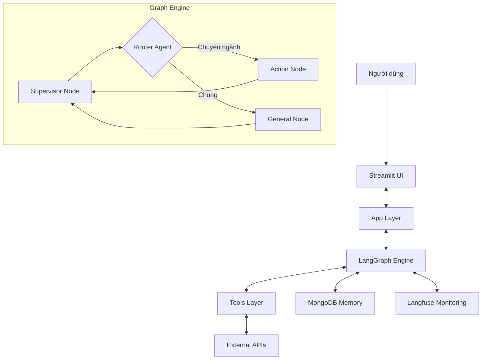

# AVA Assistant - Dự án mẫu với LangGraph

Đây là dự án mẫu triển khai AVA (Trợ lý ảo MISA) sử dụng LangGraph, cung cấp kiến trúc tham khảo cho việc xây dựng một hệ thống AI Assistant hoàn chỉnh.

## Kiến trúc tổng quan



## Các thành phần chính

### 1. Kiến trúc Graph đa cấp

- **Supervisor Node**: 
  - Điểm khởi đầu của graph chính
  - Điều phối luồng xử lý
  - Quyết định chuyển hướng tin nhắn tới node chuyên biệt thông qua Router

- **Router Agent**:
  - Phân tích ngữ cảnh tin nhắn
  - Định tuyến tới node xử lý phù hợp

- **Các graph chuyên biệt**:
  - `action_graph`: Xử lý các hành động chuyên ngành (tạo chứng từ kế toán, báo cáo, tính thuế)
  - `general_graph`: Xử lý các câu hỏi thông thường

### 2. Hệ thống lưu trữ và giám sát

- **MongoDB Saver**: 
  - Lưu trữ trạng thái graph giữa các phiên
  - Duy trì lịch sử hội thoại dài hạn

- **Langfuse**: 
  - Giám sát và đánh giá hiệu suất của hệ thống
  - Theo dõi chi phí token và độ trễ
  - Thu thập phản hồi chất lượng

### 3. Giao diện người dùng

- **Streamlit UI**:
  - Hiển thị hội thoại theo thời gian thực
  - Hiển thị thông tin chi tiết về tool execution
  - Cung cấp các cấu hình tùy chỉnh

- **Streaming response**:
  - Hiển thị phản hồi theo từng phần khi được tạo ra
  - Giảm thời gian chờ đợi của người dùng

### 4. Hệ thống Tools

- **Tools chung**:
  - Lấy thông tin thời tiết và giá vàng
  - Thu thập thông tin địa điểm, người dùng

- **Tools chuyên ngành**:
  - Tạo chứng từ kế toán
  - Tạo báo cáo tài chính
  - Tính toán thuế

### 5. Triển khai và mở rộng

- **Docker**:
  - Đóng gói ứng dụng và dependencies
  - Dễ dàng triển khai trên nhiều môi trường

- **Kiến trúc module**:
  - Tổ chức code theo chức năng
  - Dễ dàng mở rộng thêm node và tools mới

## Quy trình xử lý tin nhắn

1. Người dùng gửi tin nhắn thông qua Streamlit UI
2. App khởi tạo session và context cho người dùng
3. Supervisor node nhận tin nhắn đầu vào
4. Router Agent phân tích và định tuyến đến node chuyên biệt
5. Node chuyên biệt xử lý với các công cụ liên quan
6. Kết quả được trả về Supervisor và hiển thị cho người dùng
7. Toàn bộ quá trình được ghi log và lưu trữ

## Cấu hình và khởi động

```bash
# Khởi động ứng dụng với Streamlit
streamlit run app.py

# Triển khai với Docker
docker-compose up
```

## Giá trị học tập

- **Tổ chức dự án**: Cách tổ chức một dự án AI Assistant phức tạp
- **Kiến trúc LangGraph**: Xây dựng hệ thống có khả năng mở rộng và linh hoạt
- **Quản lý trạng thái**: Lưu trữ và phục hồi trạng thái hội thoại
- **Tích hợp công cụ**: Mở rộng khả năng của LLM với các công cụ bên ngoài
- **UI/UX**: Thiết kế giao diện chat đáp ứng và thân thiện
- **Monitoring**: Theo dõi và tối ưu hóa hiệu suất hệ thống

## Tư liệu tham khảo

- [LangGraph Documentation](https://docs.langchain.com/docs/langgraph)
- [Streamlit Documentation](https://docs.streamlit.io/)
- [MongoDB Documentation](https://docs.mongodb.com/)
- [Langfuse Documentation](https://langfuse.com/docs)
